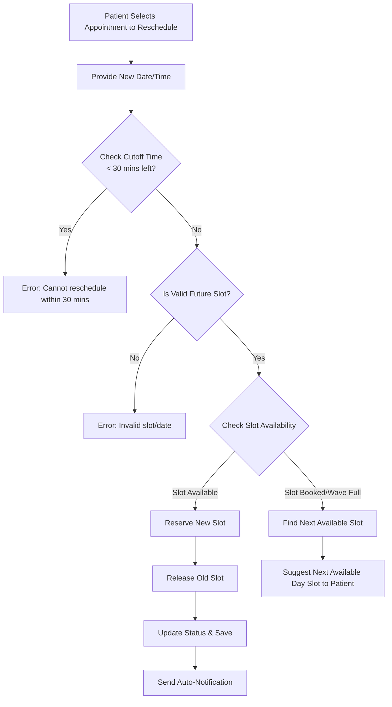

# Appointment Rescheduling Flow Chart

```mermaid
graph TD
    A[Patient Selects Appointment to Reschedule] --> B[Provide New Date/Time]
    B --> C{Check Cutoff Time <br/> < 30 mins left?}
    C -- Yes --> D[Error: Cannot reschedule within 30 mins]
    C -- No --> E{Is Valid Future Slot?}
    
    E -- No --> F[Error: Invalid slot/date]
    E -- Yes --> G{Check Slot Availability}
    
    G -- Slot Available --> H[Reserve New Slot]
    H --> I[Release Old Slot]
    I --> J[Update Status & Save]
    J --> K[Send Auto-Notification]
    
    G -- Slot Booked/Wave Full --> L[Find Next Available Slot]
    L --> M[Suggest Next Available Day Slot to Patient]
```
