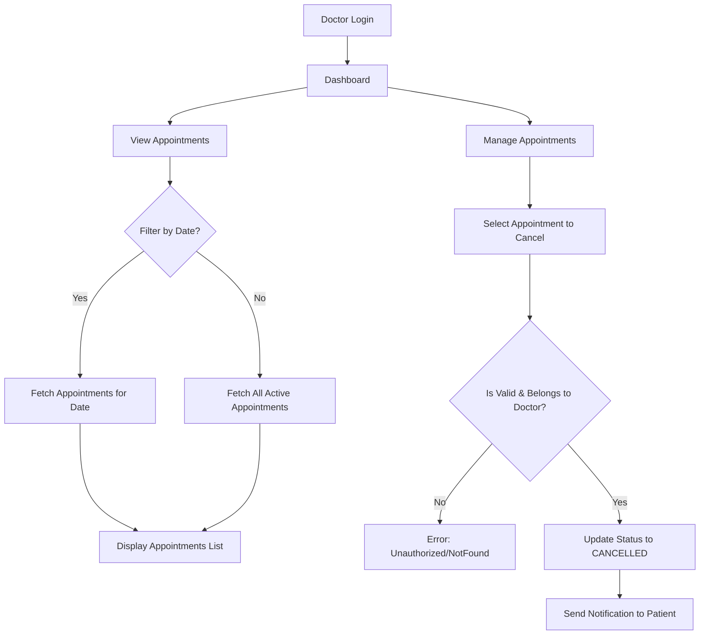

# Doctor Appointment Management Flow Chart

```mermaid
graph TD
    A[Doctor Login] --> B[Dashboard]
    B --> C[View Appointments]
    C --> D{Filter by Date?}
    D -- Yes --> E[Fetch Appointments for Date]
    D -- No --> F[Fetch All Active Appointments]
    E --> G[Display Appointments List]
    F --> G
    
    B --> H[Manage Appointments]
    H --> I[Select Appointment to Cancel]
    I --> J{Is Valid & Belongs to Doctor?}
    J -- No --> K[Error: Unauthorized/NotFound]
    J -- Yes --> L[Update Status to CANCELLED]
    L --> M[Send Notification to Patient]
```
