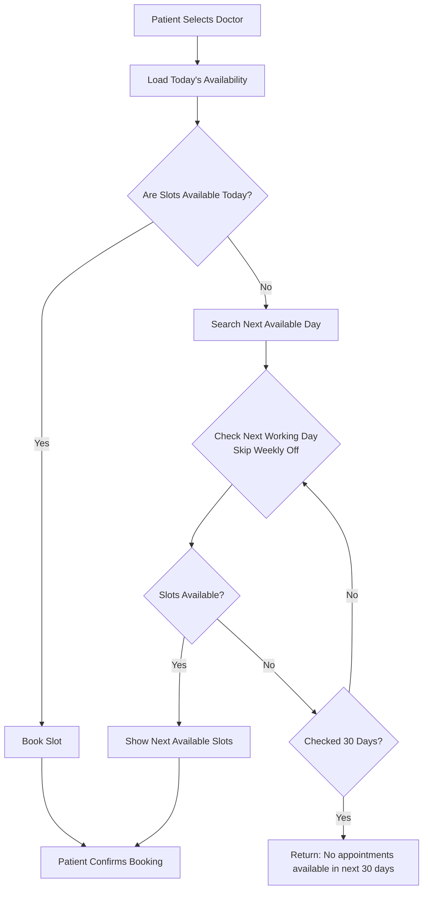

# Next Available Appointment Booking Flow Chart

```mermaid
graph TD
    A[Patient Selects Doctor] --> B[Load Today's Availability]
    B --> C{Are Slots Available Today?}
    C -- Yes --> D[Book Slot]
    C -- No --> E[Search Next Available Day]
    
    E --> F{Check Next Working Day <br/> Skip Weekly Off}
    F --> G{Slots Available?}
    G -- Yes --> H[Show Next Available Slots]
    G -- No --> I{Checked 30 Days?}
    
    I -- No --> F
    I -- Yes --> J[Return: No appointments available in next 30 days]
    
    H --> K[Patient Confirms Booking]
    D --> K
```
