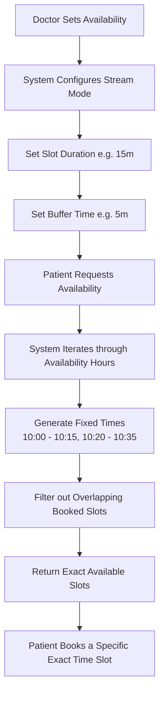

# Stream Scheduling Flow Chart

```mermaid
graph TD
    A[Doctor Sets Availability] --> B[System Configures Stream Mode]
    B --> C[Set Slot Duration e.g. 15m]
    C --> D[Set Buffer Time e.g. 5m]
    D --> E[Patient Requests Availability]
    E --> F[System Iterates through Availability Hours]
    F --> G[Generate Fixed Times <br/> 10:00 - 10:15, 10:20 - 10:35]
    G --> H[Filter out Overlapping Booked Slots]
    H --> I[Return Exact Available Slots]
    I --> J[Patient Books a Specific Exact Time Slot]
```
