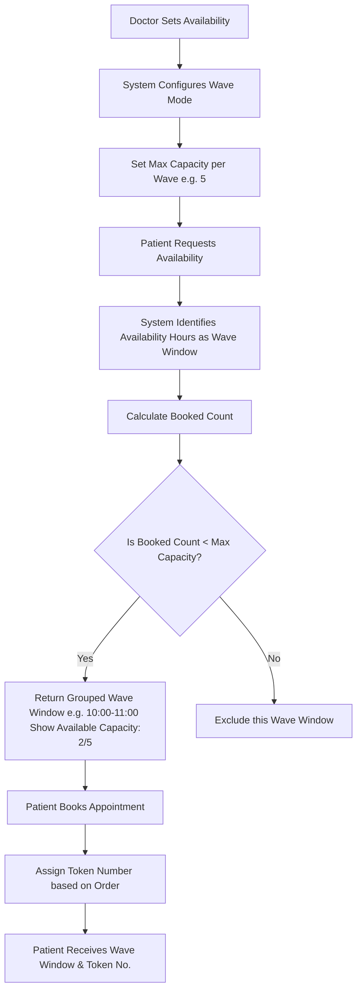

# Wave Scheduling Flow Chart

```mermaid
graph TD
    A[Doctor Sets Availability] --> B[System Configures Wave Mode]
    B --> C[Set Max Capacity per Wave e.g. 5]
    C --> D[Patient Requests Availability]
    D --> E[System Identifies Availability Hours as Wave Window]
    E --> F[Calculate Booked Count]
    F --> G{Is Booked Count < Max Capacity?}
    G -- Yes --> H[Return Grouped Wave Window e.g. 10:00-11:00 <br/> Show Available Capacity: 2/5]
    G -- No --> I[Exclude this Wave Window]
    
    H --> J[Patient Books Appointment]
    J --> K[Assign Token Number based on Order]
    K --> L[Patient Receives Wave Window & Token No.]
```
